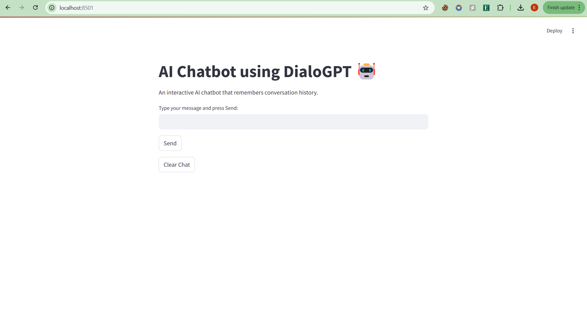
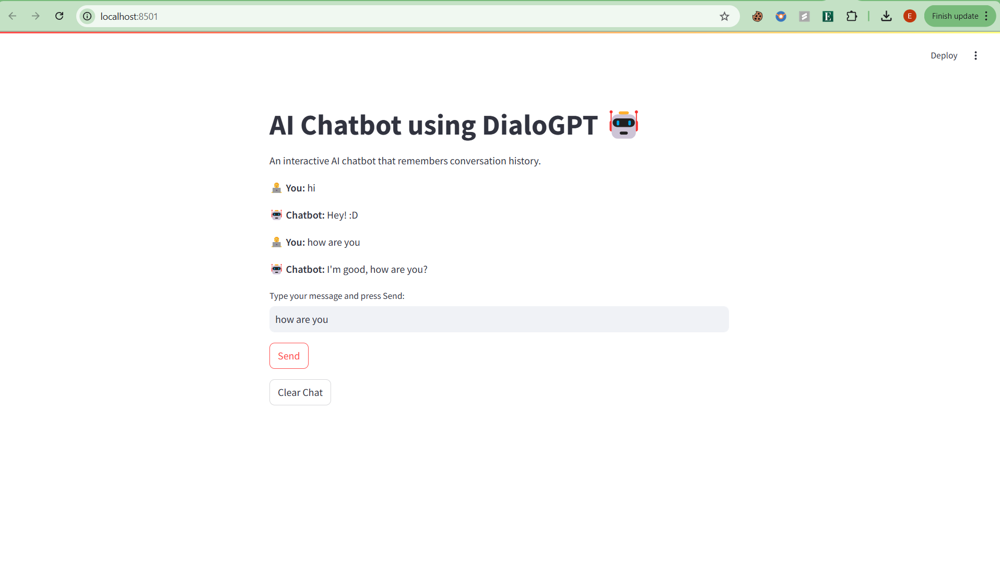
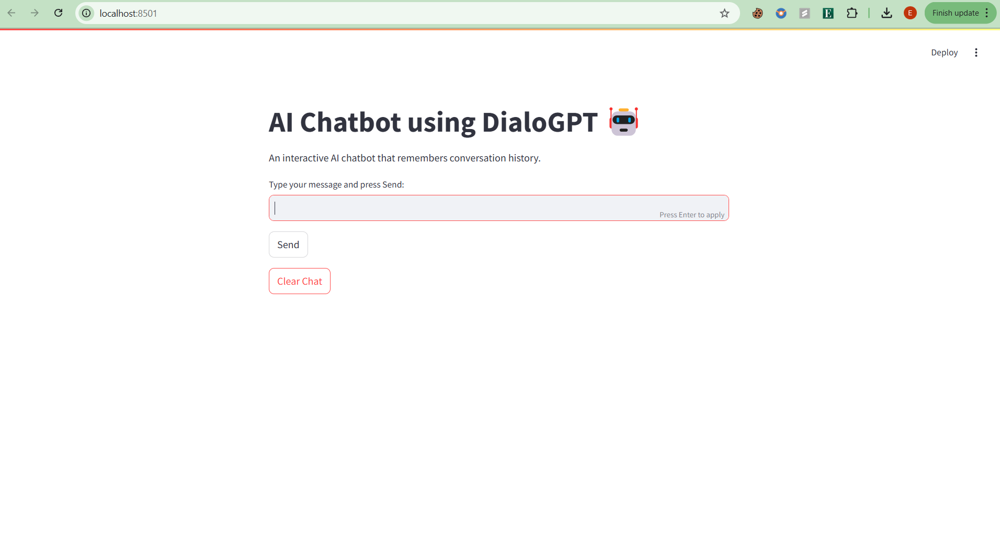
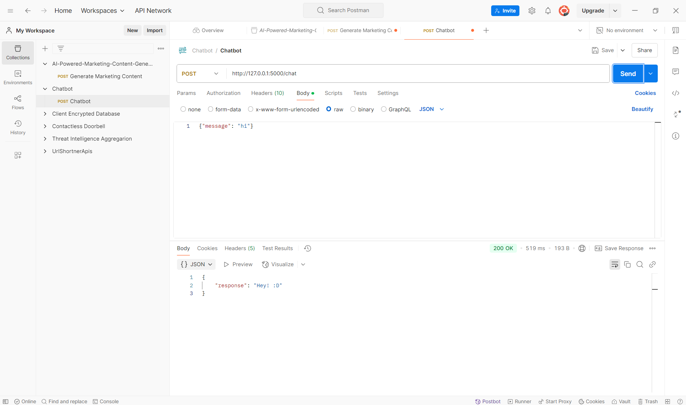
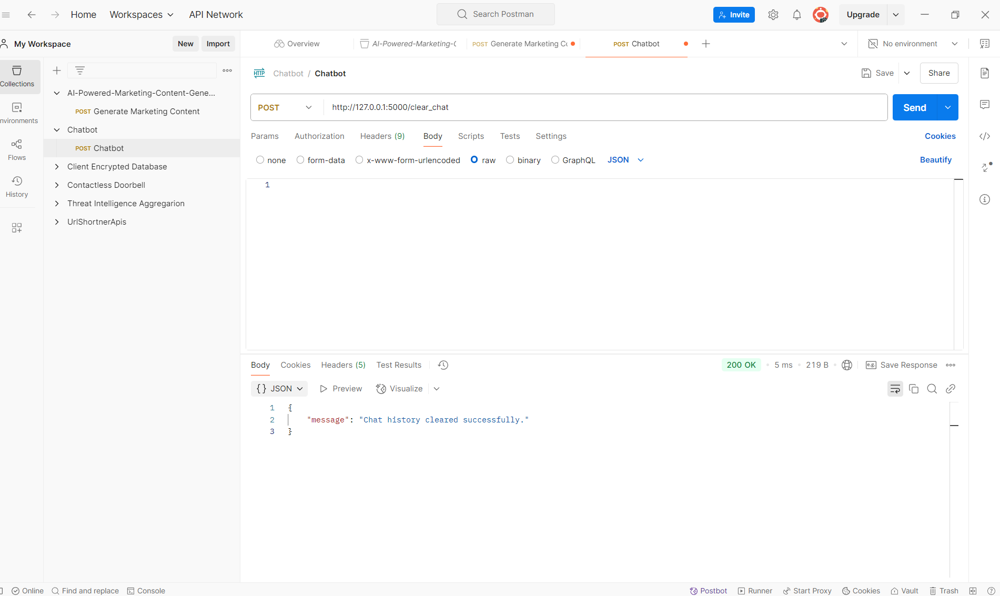

# AI Chatbot using DialoGPT

## Overview

This project is an **AI-powered chatbot** built using **DialoGPT** that maintains conversation history. The chatbot interface is created with **Streamlit**, while the backend API is handled using **Flask**.

## Features

- 🤖 **AI-Powered Chat**: Uses DialoGPT to generate conversational responses.
- 📝 **Persistent Chat History**: Remembers previous interactions.
- 🚀 **Streamlit UI**: Provides a simple and interactive chat interface.
- 🔄 **Real-time Response**: Messages are processed dynamically without page reload.
- ⏳ **Loading Animation**: Indicates when the chatbot is processing a response.
- 🔘 **Clear Chat Functionality**: Reset the conversation with a button click.
- ⚡ **Flask API**: Serves chatbot responses and manages chat history.

## Technologies Used

- **Frontend**: Streamlit
- **Backend**: Flask
- **AI Model**: Microsoft DialoGPT-Medium
- **Libraries**: Transformers, Torch, Requests

## Setup Instructions

### 1️⃣ Clone the Repository

```bash
git clone https://github.com/your-repo/chatbot-dialoGPT.git
cd chatbot-dialoGPT
```

### 2️⃣ Install Dependencies

```bash
pip install -r requirements.txt
```

### 3️⃣ Run the Backend (Flask Server)

```bash
python app.py
```

### 4️⃣ Run the Frontend (Streamlit UI)

```bash
streamlit run chatbot_ui.py
```

## API Endpoints

### 🔹 Chat with the Bot

**Endpoint:** `POST /chat`

- **Request Body:** `{ "message": "Hello!" }`
- **Response:** `{ "response": "Hi there!" }`

### 🔹 Clear Chat History

**Endpoint:** `POST /clear_chat`

- **Response:** `{ "message": "Chat history cleared successfully." }`

## Project Structure

```
📂 chatbot-dialoGPT
├── chatbot_ui.py     # Streamlit frontend UI
├── chatbot.py        # AI chatbot model (DialoGPT)
├── app.py            # Flask backend server
├── requirements.txt  # Required Python libraries
└── README.md         # Project documentation
```

## Screenshots

**1️⃣ Home Screen**  


**2️⃣ User Asking a Question and Chatbot Response**  


**3️⃣ Clear Chat**  


**4️⃣ Backend Working**  



## Future Enhancements

- ✨ **Voice Input Support**
- 🎨 **Improved UI with Custom Themes**
- 🌎 **Multilingual Support**
- 📚 **More Advanced Conversational Abilities**
